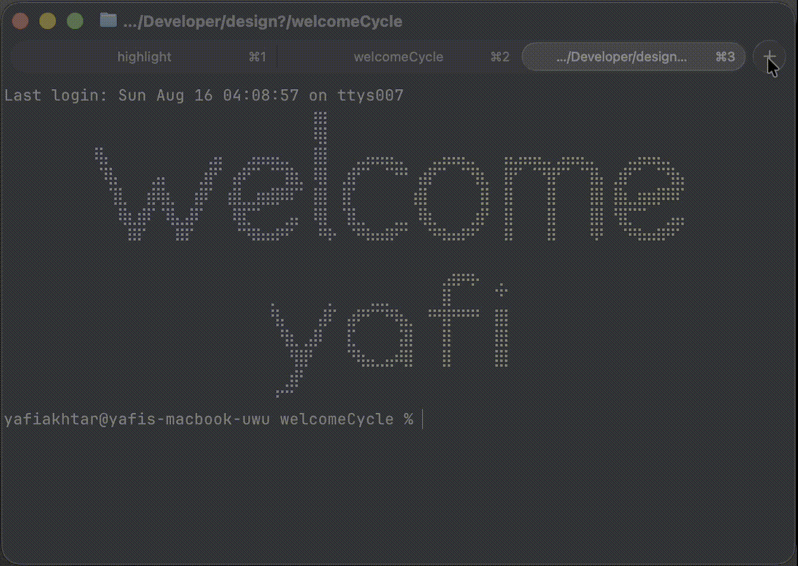

# Multilingual Terminal Welcome



Animate a multilingual welcome whenever a new interactive terminal opens. The
greetings appear in a random order and settle on English, while the Yafi artwork
stays centered in the same place below them.

Because the animation is loaded by your shell, one setup works in Apple
Terminal, Ghostty, Cursor's integrated terminal, and other terminal apps that
start zsh or Bash.

## Install on macOS with zsh

From this project directory, run:

```sh
./install.sh
```

The installer copies the script and artwork to `~/.welcome` and adds this line
to `~/.zshrc` if it is not already present:

```sh
[ -r "$HOME/.welcome/welcome.sh" ] && . "$HOME/.welcome/welcome.sh"
```

Open a new terminal window or tab to see the result.

## Bash setup

The helper supports Bash as well, but the installer does not change Bash startup
files. Add the same source line to `~/.bashrc`:

```sh
[ -r "$HOME/.welcome/welcome.sh" ] && . "$HOME/.welcome/welcome.sh"
```

On macOS, a Bash login shell may load `~/.bash_profile` instead. In that case,
have it load `~/.bashrc`:

```sh
[ -r "$HOME/.bashrc" ] && . "$HOME/.bashrc"
```

## Controls

```sh
welcome off
welcome on
welcome status
```

The setting is shared by zsh and Bash and stored at
`${XDG_CONFIG_HOME:-$HOME/.config}/terminal-welcome/state`. It is enabled by
default.

## Display behavior

- Each eligible non-English greeting appears once in a random order for 250 ms.
- English is always the final frame and remains above the prompt.
- Welcome and Yafi are centered within an 81-column canvas. On narrower
  terminals, the canvas shrinks and artwork that cannot fit is skipped.
- Below 63 columns, the animation becomes a compact `Welcome Yafi` line.
- The animation uses the terminal's existing foreground color.

The artwork uses Unicode braille characters, so a monospace font with those
glyphs is required.

## Development check

```sh
./tests/test.sh
```
